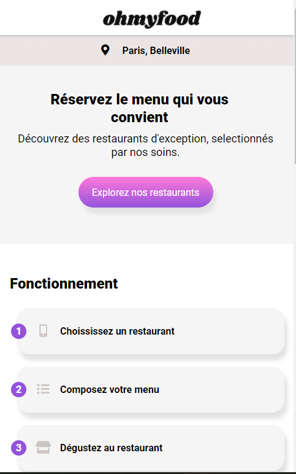

# Projet_3_ohmyfood

L'objectif est le devellopement en mobile-first qui repertorie les menus de plusieurs retaurants gastronomiques.
Utilisation de vs-code et du plugin Sass.
Intégration des nimations demandés dans le Brief.
Aucune erreur ni alerte au validateur W3C HTML et CSS. 

## Fonctionnalités

En plus d'un systeme classique de reservation, les clients pourront composer le menu de leur repas pour que les plats soient prêts à leur arrivée.

## Contraintes techniques

1. Maquettes fournies : 100% mobile.
1. Les polices sont : Shrikhand(logo et titre) et Roboto (texte).
1. Les couleurs de la charte sont Primaire #9356DC, secondaire #FF79DA et tertiaire #99E2D0.
1. Les icônes proviennent de la bibliothèque Font Awesome.
1. Choix du format le plus adapté par rapport à la résolution et au temps de chargement.
1. Les effets et animations sont visibles au clic ou au survol
1. apperçu d'un loading spinner sur la page d'accueil.

## Lien gitHub pages

lien : [lien vers gitHub pages](https://melaniemdm.github.io/#projet_3_ohmyfood)
